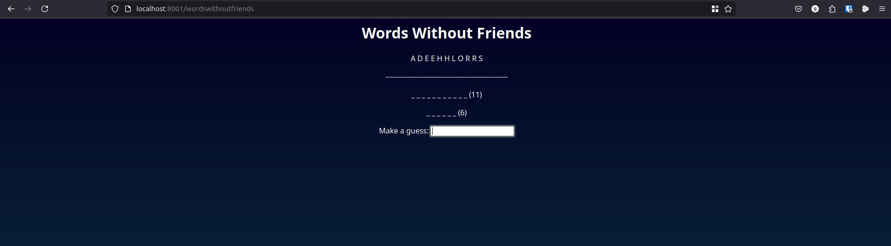

# Words Without Friends

Words Without Friends is a word game where a "master" word is chosen and its letters are used as a word bank. The player must then guess words that can be made with letters from the word bank. Words Without Friends is the main project for ICSI 333 System Fundamentals Fall 2024.

## Web Server

This project also includes a web server. The server takes a root path to serve files. If the request is "/wordswithoutfriends" then a new game is started. Players may submit a guess with the html form which results in a URL of the form "/wordswithoutfriends?move=guess". When a game is finished, a congrats screen is displayed and a link to play another round is provided.

## Demo

